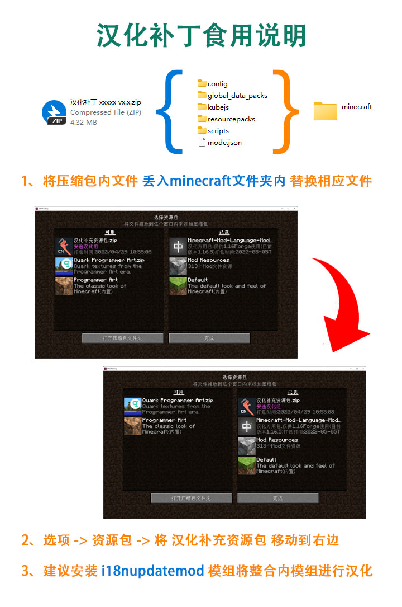

<!-- markdownlint-disable MD033 -->
# FTB-StoneBlock-3

## 仓库说明

这里是 FTB StoneBlock 3 整合包简体中文汉化仓库。

## 许可

 本作品采用<a rel="license" href="http://creativecommons.org/licenses/by-nc-nd/4.0/">知识共享署名-非商业性使用-禁止演绎 4.0 国际许可协议</a>进行许可。
